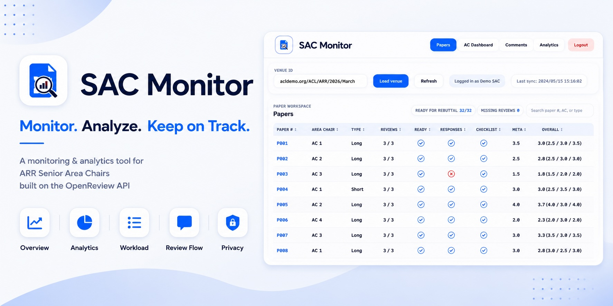
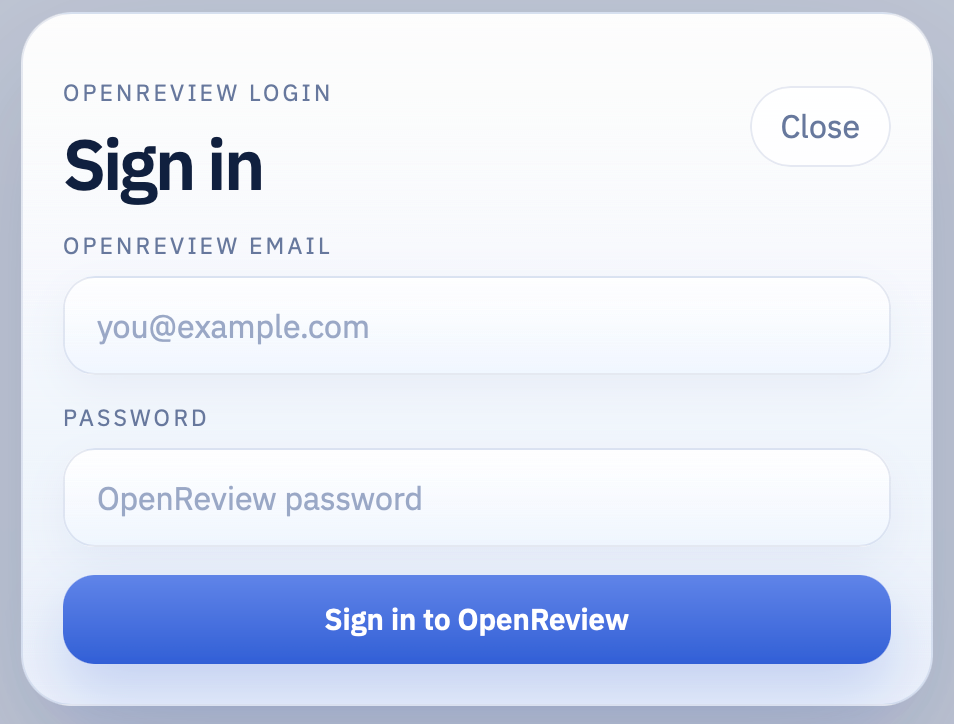
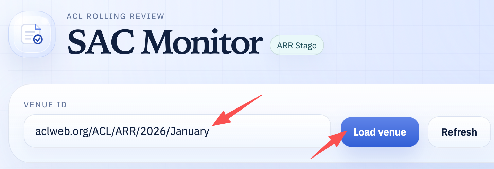
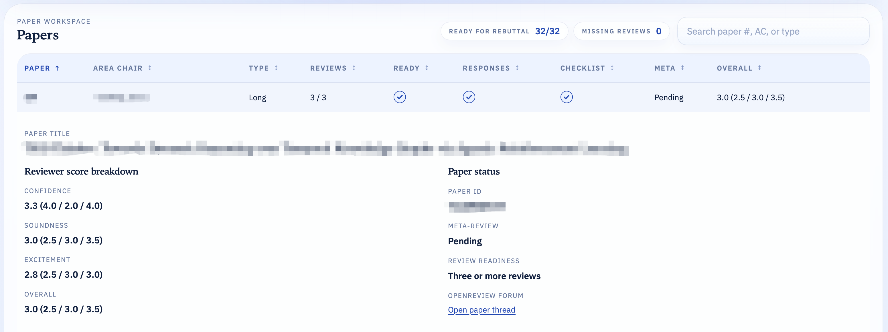
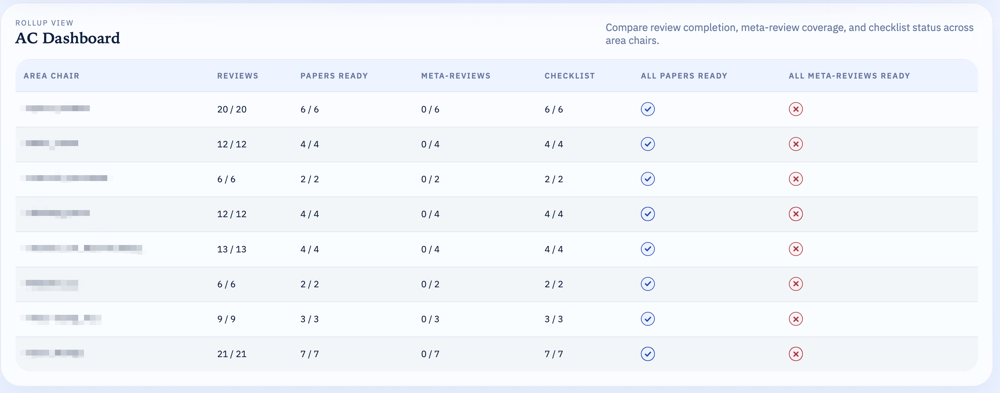
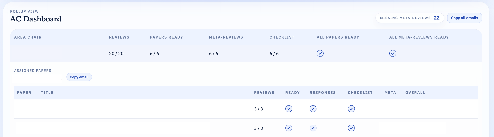
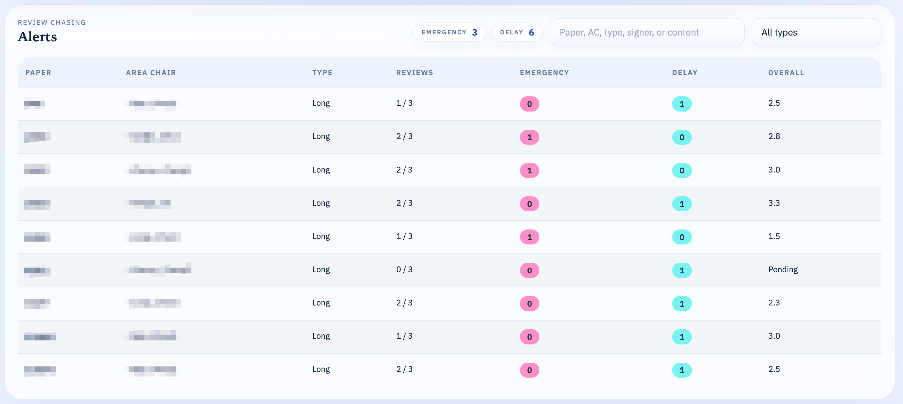
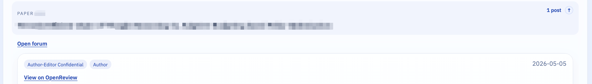
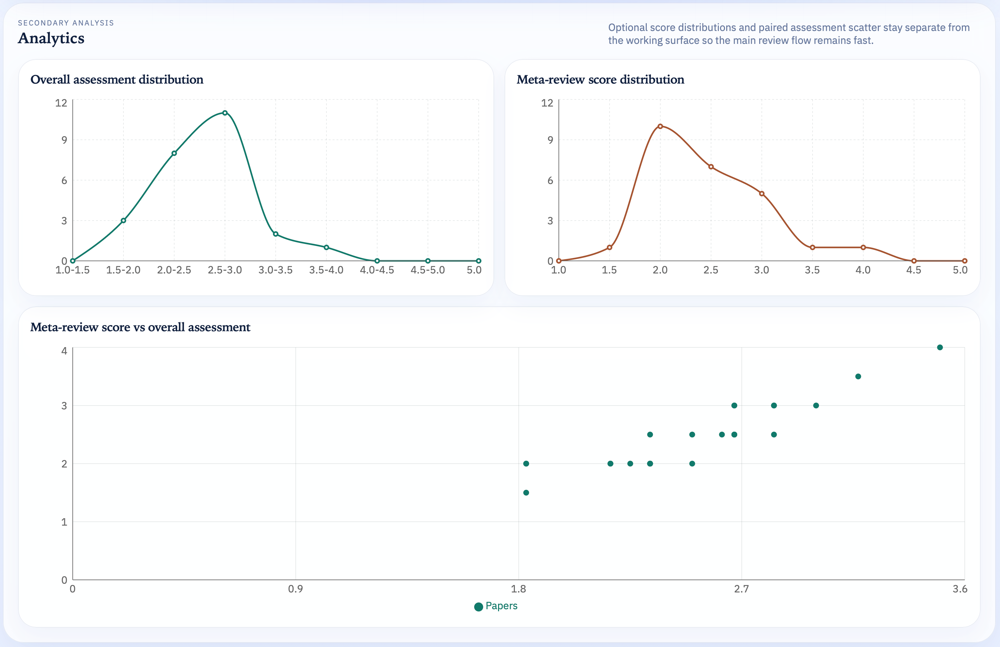
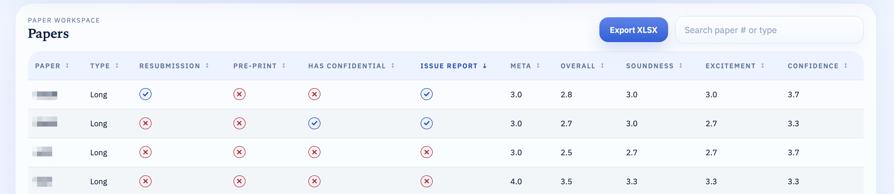

# ARR SAC Tool

A local dashboard for ACL Rolling Review and ACL commitment-stage Senior Area Chairs.

SAC Monitor helps you load your assigned OpenReview venue, inspect paper status, read comments, review score distributions, and export commitment-stage papers to Excel for offline ranking. It runs on your own machine and uses your OpenReview login only for the current local session.



> [!NOTE]
> 1. **Use the latest code when available (an icon will show if there are updates) to get the latest features and bug fixes.**
> 2. If you prefer the jupyter notebook version, please check `old` branch, which is the version I used in ARR Feb 2025 cycle.
> 3. If you want to run the dashboard in a Colab notebook, please check the "[Running In Colab](#running-in-colab)" section below for instructions (will not be maintained). 
> 4. For detailed changelog, please check [CHANGELOG.md](./CHANGELOG.md).

## Latest Supported Venues

| ARR Stage                                                    | Commitment Stage               |
| ------------------------------------------------------------ | ------------------------------ |
| aclweb.org/ACL/ARR/2026/January <br/>aclweb.org/ACL/ARR/2026/March<br/>**aclweb.org/ACL/ARR/2026/May** | aclweb.org/ACL/2026/Conference |

## Requirements

Before running the dashboard, make sure you have:

- An OpenReview account with SAC access to the venue you want to inspect
- Node.js with `npm`
- Python 3.9 or newer

If you do not already have Node.js and `npm`, install Node.js from [nodejs.org](https://nodejs.org/). The `npm` command is included with the standard Node.js installer.

## Installation

Just run:
```bash
npm install
```

You only need to run `npm install` once after downloading the repository, or again later if the project dependencies change (not often).

## Start The Dashboard

1. Run `npm run dev`
2. Open [http://127.0.0.1:8000](http://127.0.0.1:8000)
3. Sign in with your OpenReview email and password
4. Enter a venue ID and click **Load venue**

ARR example:

`aclweb.org/ACL/ARR/2026/March`

Commitment-stage example:

`aclweb.org/ACL/2026/Conference`

The first `npm run dev` creates a local Python environment in `.venv` and installs the backend requirements automatically. Later launches should be faster.

## What You Can Monitor

- ARR review-stage venues, shown as **ARR Stage**
- Commitment-stage conference venues, shown as **Commitment Stage**
- Per-paper status, scores, comments, and analytics
- ARR-stage AC rollups
- Commitment-stage ranking fields, including XLSX export for offline SAC ranking

The venue textbox remembers recently loaded valid venue IDs, so you do not need to retype common venues each time.

## Usage for ARR Stage

As indicated above, Open [http://127.0.0.1:8000](http://127.0.0.1:8000) in your browser first, then sign in with your OpenReview email and password. Enter your venue ID and click **Load venue**. The dashboard will load the venue data and display it in the corresponding section.

<p align="center">
    <br>
    
    <br>
</p>

<p align="center">
    <br>
    
    <br>
</p>

### Page: Papers

The `Paper` page will show all papers in the ARR review stage. Clicking on a paper will show its details.

The top part also shows how many papers are ready for rebuttal (i.e., at least three reviews have been submitted) and how many missing reviews.

<p align="center">
    <br>
    
    <br>
</p>

### Page: AC Dashboard

In `AC Dashboard`, you can check each AC's assigned papers and their review status, which is useful to check review/meta-review progress.

<p align="center">
    <br>
    
    <br>
</p>

Clicking on an AC will show the papers assigned to that AC and their review status. There is also a button to copy AC's email address for easy communication, which is especially useful for SACs to contact ACs personally (as some people may not receive notifications from OpenReview).

<p align="center">
    <br>
    
    <br>
</p>

### Page: Alerts (New)

In `Alerts`, you can check critical alerts that need to draw SAC attention, such as `delay notifications`, `emergency declarations`, etc. This is helpful in late review chasing period, to see whether new reviewers are assigned to replace the missing reviewers.

<p align="center">
    <br>
    
    <br>
</p>


### Page: Comments

In `Comments`, you can check critical comments that need to draw SAC attention, such as author-editor confidential comments, review issue reports, etc.

Clicking a comment will show its content, and you can also click the "View on OpenReview" link to open the comment in the original OpenReview page to get better context.

<p align="center">
    <br>
    
    <br>
</p>

### Page: Analytics

In `Analytics`, you can view various metrics and visualizations related to the papers and reviews in the ARR stage.

<p align="center">
    <br>
    
    <br>
</p>

## Usage for Commitment Stage

Similar to the ARR stage, you can load a commitment-stage venue and check the papers assigned to you. The `Commitment Stage` section will show the papers in the commitment stage.

The main goal of commitment stage for SACs is to rank the papers and give a recommendation on whether to accept or reject. You can click the "Export to Excel" button to export the papers assigned to you into an Excel file, which contains most of the information you need for ranking, such as paper scores, meta-reviews, etc.

<p align="center">
    <br>
    
    <br>
</p>

> [!CAUTION]
>  Please do not solely rely on the exported Excel file for ranking, as it may not contain all the information you need (like detailed reviews, etc.). Always check the original OpenReview page for each paper to get the full context before making your final decision.

## Running In Colab

You can check this notebook, which contains step-by-step instructions to run the dashboard in Colab: [ARR SAC Tool in Colab](https://colab.research.google.com/drive/1b-jFIEwWNPZVPwTS_FL8iQoVe4ijj6TL?usp=sharing).

**Colab is not the ideal home for this dashboard**, because the app is designed as a local web dashboard with a Next.js frontend and a FastAPI backend. It can run there for temporary use, though, as long as you expose only the web port and let Next proxy API requests to the backend.

In a Colab notebook, after cloning the repository:

```bash
%cd arr_sac_tool
!npm install
```

Build the web app, then start the production servers with the web server bound to all interfaces:

```bash
!ARR_SAC_USE_SYSTEM_PYTHON=1 ARR_SAC_API_PYTHON=python3 npm run build
!ARR_SAC_USE_SYSTEM_PYTHON=1 ARR_SAC_API_PYTHON=python3 ARR_SAC_WEB_HOST=0.0.0.0 npm run start
```

Expose port `8000` with a temporary Cloudflare tunnel:

```bash
!wget -q https://github.com/cloudflare/cloudflared/releases/latest/download/cloudflared-linux-amd64 -O cloudflared
!chmod +x cloudflared
!./cloudflared tunnel --url http://127.0.0.1:8000
```

Open the `https://....trycloudflare.com` URL printed by `cloudflared`. Keep both the `npm run start` cell and the tunnel cell running while you use the dashboard. The backend remains private inside the Colab runtime on port `8001`; browser requests go through the frontend's `/api` proxy.

> [!CAUTION]
> Treat the tunnel URL as private. Do not share it, and stop the tunnel cell when you are done.

## Privacy

- Your OpenReview credentials are sent only to the local backend running on your machine.
- Credentials are not written to disk by this app.
- Loaded dashboard data is cached in memory for faster refreshes during the current local run.


## Feedback

As ARR and *ACL conferences are making updates to processes and tools, the provided tools may not fully adapt to any ARR cycle or commitment stage. If you encounter any issues or have suggestions for improvement, please feel free to open an issue in this repository.
